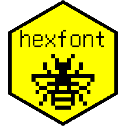

# hexfont 

[](https://cran.r-project.org/package=hexfont)
[](https://github.com/trevorld/hexfont/actions)

### Table of Contents

* [Overview](#overview)
* [Included hex font files](#hex)
* [Examples](#examples)
* [License](#license)

**Please note this README is best [viewed elsewhere](https://trevorldavis.com/R/hexfont/) than `github.com`**. `github.com`'s default `line-height` setting causes distracting extraneous horizontal lines to appear when "printing" bitmaps and `github.com` [does not allow using CSS](https://gist.github.com/kivikakk/622b5dcf395e26c49e2334f0eb19e6f9) to set a more reasonable `line-height` value.

## <a name="overview">Overview</a>

This is an R data package that includes most "hex" font files from the [GNU Unifont](https://unifoundry.com/unifont/index.html) project compressed by `xz`.  It includes a convenience function that loads several of them as a [{bittermelon}](https://github.com/trevorld/bittermelon) `bm_font()` object.  GNU Unifont is a duospaced bitmap font (8x16 and 16x16 glyphs) that pretty much covers all of the official Unicode glyphs plus several of the artificial scripts in the [(Under-)ConScript Unicode Registry](https://www.kreativekorp.com/ucsur/).

## <a name="hex">Included hex font files</a>

`{hexfont}` includes most of the hex font files included in the [GNU Unifont](https://unifoundry.com/unifont/index.html)
source code distribution.  The version number is stripped from the file names in the `precompiled` directory and
the hex fonts are all compressed by `xz` but other than that the hex fonts are otherwise unchanged.  Due to CRAN size limitations we omit the "precompiled" `unifont_all` hex file (this is presumably the concatenation of the "precompiled" `unifont` and `unifont_upper` hex files).


``` r
hex_dir <- system.file("font", package = "hexfont")
list.files(hex_dir, pattern = ".hex.xz", recursive = TRUE)
```

```
##  [1] "plane00/alt/codepage-437.hex.xz"           
##  [2] "plane00/alt/izmg16-plane00-FFxx.hex.xz"    
##  [3] "plane00/alt/mongolian-vertical.hex.xz"     
##  [4] "plane00/alt/phags-pa-vertical.hex.xz"      
##  [5] "plane00/alt/quad-width.hex.xz"             
##  [6] "plane00/alt/reiwa-vertical.hex.xz"         
##  [7] "plane00/alt/uni0009-orig.hex.xz"           
##  [8] "plane00/copyleft.hex.xz"                   
##  [9] "plane00/custom00.hex.xz"                   
## [10] "plane00/hangul-syllables.hex.xz"           
## [11] "plane00/izmg16-plane00.hex.xz"             
## [12] "plane00/omit.hex.xz"                       
## [13] "plane00/plane00-nonprinting.hex.xz"        
## [14] "plane00/plane00-unassigned.hex.xz"         
## [15] "plane00/pua.hex.xz"                        
## [16] "plane00/spaces.hex.xz"                     
## [17] "plane00/unifont-base.hex.xz"               
## [18] "plane00/wqy.hex.xz"                        
## [19] "plane00csur/plane00csur-nonprinting.hex.xz"
## [20] "plane00csur/plane00csur-spaces.hex.xz"     
## [21] "plane00csur/plane00csur-unassigned.hex.xz" 
## [22] "plane00csur/plane00csur.hex.xz"            
## [23] "plane01/plane01-nonprinting.hex.xz"        
## [24] "plane01/plane01-noscript.hex.xz"           
## [25] "plane01/plane01-space.hex.xz"              
## [26] "plane01/plane01-unassigned.hex.xz"         
## [27] "plane01/plane01.hex.xz"                    
## [28] "plane01/space.hex.xz"                      
## [29] "plane02/izmg16-plane02.hex.xz"             
## [30] "plane02/zh-plane02.hex.xz"                 
## [31] "plane03/jp-plane03.hex.xz"                 
## [32] "plane03/zh-plane03.hex.xz"                 
## [33] "plane0E/plane0E-nonprinting.hex.xz"        
## [34] "plane0E/plane0E-unassigned.hex.xz"         
## [35] "plane0E/plane0E.hex.xz"                    
## [36] "plane0Fcsur/plane0Fcsur-nonprinting.hex.xz"
## [37] "plane0Fcsur/plane0Fcsur.hex.xz"            
## [38] "precompiled/unifont_jp_sample.hex.xz"      
## [39] "precompiled/unifont_jp.hex.xz"             
## [40] "precompiled/unifont_sample.hex.xz"         
## [41] "precompiled/unifont_upper_sample.hex.xz"   
## [42] "precompiled/unifont_upper.hex.xz"          
## [43] "precompiled/unifont.hex.xz"
```

## <a name="examples">Examples</a>

The main function `unifont()` loads in several GNU Unifont hex files at the same time as a [{bittermelon}](https://github.com/trevorld/bittermelon) `bm_font()` object.  Arguments:

| Argument | Meaning | Default |
--- | --- | ---
| upper | Include glyphs above the Unicode Basic Multilingual plane | `TRUE` | 
| jp | Use Japanese version of Chinese characters | `FALSE` | 
| csur | Include (Under-)Conscript Unicode Registry glyphs | `TRUE` |
| sample | Add circle to "Combining" characters | `FALSE` | 
| ucp | Character vector of Unicode Code Points to only load | `NULL` |
| cache | Read/write a pre-compiled font from/to `tools::R_user_dir("hexfont", "cache")` | `FALSE` |


``` r
library("bittermelon")
library("hexfont")
system.time(font <- unifont()) # Unifont is a **big** font
```

```
##    user  system elapsed 
## 147.807   0.190 148.030
```

``` r
length(font) |> prettyNum(big.mark = ",") # number of glyphs
```

```
## [1] "125,472"
```

``` r
object.size(font) |> format(units = "MB") # memory used
```

```
## [1] "198.7 Mb"
```

``` r
# Faster to load from a cache
system.time(font <- unifont(cache = TRUE))
```

```
##    user  system elapsed 
##   0.758   0.000   0.758
```

``` r
# Or just load the subset of GNU Unifont you need
s <- "Ｒ很棒！"
system.time(font_s <- unifont(ucp = str2ucp(s)))
```

```
##    user  system elapsed 
##   0.740   0.000   0.739
```

``` r
# Mandarin Chinese
as_bm_bitmap(s, font = font_s) |>
    bm_compress("v")
```

```
##                     █ ▄▄▄▄▄▄▄      █      █                     
##    ▄▄▄▄▄▄▄        ▄▀  █     █      █  ▀▀▀▀█▀▀▀▀      ▄█▄        
##     █     ▀▄     ▀  █ █▀▀▀▀▀█   ▀▀▀█▀▀ ▀▀█▀▀▀▀       ███        
##     █     ▄▀      ▄█  █▄▄▄▄▄█     ██▄ ▀▀█▀▀▀█▀▀      ▀█▀        
##     █▀▀▀█▀      ▄▀ █  █  █  ▄▀   █ █ ▀▄▀  █  ▀▄       █         
##     █    ▀▄        █  █   █▀    ▀  █    ▀▀█▀▀                   
##    ▄█▄    ▄█▄      █  █ ▄  ▀▄      █  ▀▀▀▀█▀▀▀▀       █         
##                    █  █▀     ▀▀    █      █
```

``` r
# Emoji
as_bm_bitmap("🐭🐲🐵", font = font) |>
    bm_compress("v")
```

```
##   ▄▄       ▄▄           ▄▄▄            ▄▄       
## ▄▀  ▀▄▄▄▄▄▀  ▀▄       ▄█▀           ▄█▀██▀█▄    
## █    ▀   ▀    █      ▄████       ▄▀█ ▄▄  ▄▄ █▀▄ 
## ▄█   ▀   ▀   █▄   ▄▄██▄█████     ▀▄█ ▀▀  ▀▀ █▄▀ 
## ▄█▀    ▄    ▀█▄ ▄█▄███████████     ▄▀      ▀▄   
##   ▀▄  ▀▀▀  ▄▀   ▀▀▀▀▀███▀▀█████    █ ▀▄▄▄▄▀ █   
##     ▀▀▄▄▄▀▀        ▄███   ████▀     ▀▀▄▄▄▄▀▀    
##                   ▀▀▀     ▀▀▀
```

``` r
# Klingon
as_bm_list("", font = font) |>
    bm_pad(type = "trim", left = 1L, right = 1L) |>
    bm_call(cbind) |>
    bm_compress("v")
```

```
##                                                                               
##     ▄█▄ ▄▄██▀▀  ▀▀████████               ▄▀       ▄█▄    ▄█▀  ▀█▄    ▄▄       
##  ▄▄██████▀            ▀██ ▀            ▄█▀       ███▀▀  ███    ██   ▀████████ 
##   ▀██  ██             ▄███    ▄█      ▄██       ██▀      ▀██▄▄█▀      ██▀ ▀██ 
##    ▀    █▄           ███      ███▄▄▄▄▄██      ▄███        ▀███▀      ▄█▀   █▀ 
##          █▄          ▀█▄      ██▀▀▀▀▀▀███    ▄██████▄       ▀█▄     ▄█▀   █▀  
##           ▀▄           ▀▀▄   ▄▀        ▀█▄         ▀▀▄        ▀▀▄  ▄▀    ▀    
## 
```

``` r
# Tengwar with combining glyphs
bml <- as_bm_list("", font = font)
to_raise <- which(names(bml) %in% c("U+E04A", "U+E04E"))
bml[to_raise] <- bm_shift(bml[to_raise], top = 1L)
bml |> bm_compose(pua_combining = unifont_combining()) |>
    bm_pad(type = "trim", left = 1L, right = 1L) |>
    bm_call(cbind) |>
    bm_compress("v")
```

```
##                  ▄                    ██       ▄      ▄ ▄   
##                 █ ▀                 ▄▄  ▄▄    █ ▀    █ █ ▀  
##                 ▀                   ▀▀  ▀▀    ▀      ▀ ▀    
##  █▄▀▀█▄▄▀▀█▄  █▄▀▀█▄  █▄▀▀█▄▄▀▀█▄   █▄▀▀█▄ ▀▀▀█▀▀▀▀ ▀██▀▀▀█ 
##  █    █    █  █    █  █   ▄█   ▄█   █    █   █       █▄  ▄█ 
##  █  ▀▀   ▀▀   ▀  ▀▀   █▀▀▀▀▀▀▀▀▀▀▀  █  ▀▀   ▄▀        ▀▀▀ █ 
##  █                    █             █       █             █ 
##  █                    █             █       ▀█▄▄▄▀        █
```

## <a name="license">License</a>

The overall license for this package is GPL (>=2) but the bundled hex font files 
are also available under more permissive terms.  Excerpt from `font/COPYING` 

> License for `font/plane00/jiskan16-plane00.hex` and
> `font/plane02/jiskan16-plane02.hex`:
> 
>      These two files are in the Public Domain.  They were created
>      from Public Domain BDF font files jiskan16-2004-1.bdf and
>      jiskan16-2000-2.bdf.
> 
> 
> License for font files except the jiskan16 files mentioned above
> are dual-licensed under the SIL Open Font License version 1.1,
> and under this GNU license:
> 
>      All glyphs are released under the GNU General Public License
>      (GPL) version 2 or (at your option) a later version, with the
>      GNU font embedding exception:
> 
>           ** GPL v2.0 license with font embedding exception:
> 
>           As a special exception, if you create a document which
>           uses this font, and embed this font or unaltered portions
>           of this font into the document, this font does not by
>           itself cause the resulting document to be covered by
>           the GNU General Public License. This exception does not
>           however invalidate any other reasons why the document
>           might be covered by the GNU General Public License.
>           If you modify this font, you may extend this exception
>           to your version of the font, but you are not obligated
>           to do so. If you do not wish to do so, delete this
>           exception statement from your version.
